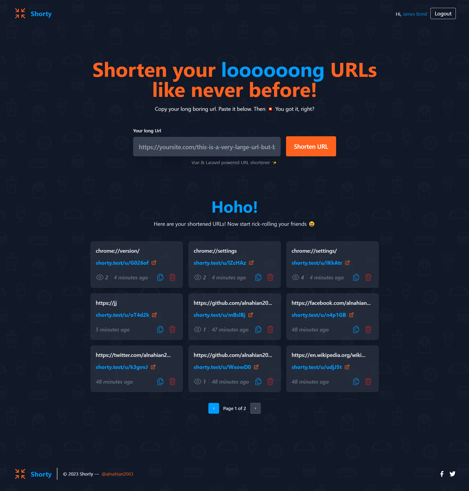

<!-- Preview Image -->



# Shorty — Vue & Laravel Powered URL Shortener

As the name suggests, Shorty shrinks your looooong boring URLs to pretty short URLs with ease! It's Vue and Laravel powered simple web application.

## Features

-   Login/Registration, Reset Password
-   Shorten Long URLs
-   Copy/Delete URLs
-   View creation date and number of link **visits count**
-   Single Page Application/SPA feels around
-   more coming soon

### Installation

Please check the [Laravel Official Documentation](https://laravel.com/docs/master/installation) installation guide for server requirements before you start.

First, clone this repo

```bash
git clone https://github.com/alnahian2003/shorty.git
```

Switch to the repo folder

```bash
cd shorty
```

Install all the dependencies using composer and npm.

```bash
composer install
```

**_Please use `--force` at end of the command, because there are some issues with the versioning of some Vite and Vue related packages._** Trust me, this project has nothing to with this confliction. So, just avoid those npm related **Warnings**.

```bash
npm install --force
```

Copy the `.env.example` file and make the required configuration changes in the .env file

```bash
cp .env.example .env
```

Generate a new application key

```bash
php artisan key:generate
```

Run the database migrations (Set the database connection in .env before migrating)

```bash
php artisan migrate
```

Start the local development server

```bash
php artisan serve
```

Start Vite for bundling the assets or Hot Module Reload (required)

```bash
npm run dev
```

**You can now access the server at http://localhost:8000.**

### TL;DR

All the command list

```bash
git clone https://github.com/alnahian2003/shorty.git
```

```bash
cd shorty
```

```bash
composer install
```

```bash
npm install --force
```

```bash
cp .env.example .env
```

```bash
php artisan key:generate
```

```bash
php artisan migrate
```

```bash
php artisan serve
```

```bash
npm run dev
```

## Database Seeding

Populate the database with seed data that includes relationships. This can help you to quickly get started and explore inside out of this project.

Run the database seeder, and this will do it!

```bash
php artisan db:seed
```

The seed data includes a demo user with associated urls. Here are the credentials:

```bash
email: admin@admin.com
password: password
```

Note : It's recommended to have a clean database before seeding. You can fresh your tables at any point to clean the database by running the following command

```bash
php artisan migrate:fresh
```

### Tech Stack

**Client Side:** TailwindCSS, Vue 3

**Server Side:** PHP, Laravel

**Database:** Sqlite 3

### TODO

-   Add profile feature
-   Use Gates & Policy to authorize
-   Maybe provide analytical data on profile/dashboard
-   Use Eloquent API Resource instead of Controllers for APIs

## Known Issues

**Please be advised that whenever you'll try to update the repo or install a new npm package using \***npm**\* then always use `--force` flag at end of the command. This repo has some conflicts with versioning problem of vite and laravel.**

#### Support

For support, [contact me](https://alnahian2003.github.io#contact) or pull an issue.
